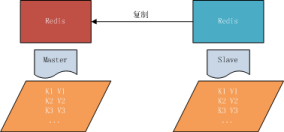
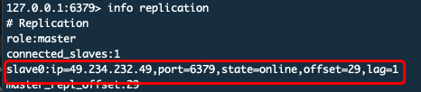

### 一、主从复制说明
#### 1.1 面临问题
在实际的场景当中单一节点的redis容易面临风险。
比如：
1. 机器故障。我们部署到一台 Redis 服务器，当发生机器故障时，需要迁移到另外一台服务器并且要保证数据是同步的。而数据是最重要的，如果你不在乎，基本上也就不会使用 Redis 了。

2. 容量瓶颈。当我们有需求需要扩容 Redis 内存时，从 16G 的内存升到 64G，单机肯定是满足不了。当然，你可以重新买个 128G 的新机器。
    - 要实现分布式数据库的更大的存储容量和承受高并发访问量，我们会将原来集中式数据库的数据分别存储到其他多个网络节点上。
    - Redis 为了解决这个单一节点的问题，也会把数据复制多个副本部署到其他节点上进行复制，实现 Redis的高可用，实现对数据的冗余备份，从而保证数据和服务的高可用。
#### 1.2 什么是主从复制


主从复制，是指将一台Redis服务器的数据，复制到其他的Redis服务器。前者称为主节点(master)，后者称为从节点(slave),数据的复制是单向的，只能由主节点到从节点。
默认情况下，每台Redis服务器都是主节点；且一个主节点可以有多个从节点(或没有从节点)，但一个从节点只能有一个主节点。

### 二、主从复制的作用
1. 数据冗余：主从复制实现了数据的热备份，是持久化之外的一种数据冗余方式。
2. 故障恢复：当主节点出现问题时，可以由从节点提供服务，实现快速的故障恢复；实际上是一种服务的冗余。
3. 负载均衡：在主从复制的基础上，配合读写分离，可以由主节点提供写服务，由从节点提供读服务（即写Redis数据时应用连接主节点，读Redis数据时应用连接从节点），分担服务器负载；尤其是在写少读多的场景下，通过多个从节点分担读负载，可以大大提高Redis服务器的并发量。
4. 读写分离：可以用于实现读写分离，主库写、从库读，读写分离不仅可以提高服务器的负载能力，同时可根据需求的变化，改变从库的数量；
5. 高可用基石：除了上述作用以外，主从复制还是哨兵和集群能够实施的基础，因此说主从复制是Redis高可用的基础。

### 三、主从复制启用
从节点开启主从复制，有3种方式：
1. 配置文件<br/>
在从服务器的配置文件中加入：slaveof <masterip> <masterport>
2. 启动命令<br/>
redis-server启动命令后加入 --slaveof <masterip> <masterport>
3. 客户端命令<br/>
Redis服务器启动后，直接通过客户端执行命令：slaveof <masterip> <masterport>，则该Redis实例成为从节点。

通过  info replication 命令可以看到复制的一些信息

保护模式
https://www.jianshu.com/p/b36923e65d01

#### 主从复制原理
https://juejin.im/entry/5b39c05df265da596e4cf399

### 四、全量复制和部分复制
#### 4.1相关概念
**全量复制**：<br/>用于初次复制或其它无法进行部分复制的情况，将主节点中的所有数据都发送给从节点，是一个非常重型的操作，当数据量较大时，会对主从节点和网络造成很大的开销

**部分复制**：<br/>用于处理在主从复制中因网络闪断等原因造成的数据丢失场景，当从节点再次连上主节点后，如果条件允许，主节点会补发丢失数据给从节点。因为补发的数据远远小于全量数据，可以有效避免全量复制的过高开销，需要注意的是，如果网络中断时间过长，造成主节点没有能够完整地保存中断期间执行的写命令，则无法进行部分复制，仍使用全量复制

**复制偏移量**<br/>
参与复制的主从节点都会维护自身复制偏移量。主节点（master）在处理完写入命令后，会把命令的字节长度做累加记录，统计信息在 info relication 中的 master_repl_offset 指标中
```
127.0.0.1:6379> info replication
# Replication
role:master
connected_slaves:1
slave0:ip=49.234.232.49,port=6379,state=online,offset=29,lag=1
master_repl_offset:29
repl_backlog_active:1
repl_backlog_size:1048576
repl_backlog_first_byte_offset:2
repl_backlog_histlen:28
```
从节点（slave）每秒钟上报自身的复制偏移量给主节点，因此主节点也会保存从节点的复制偏移量


从节点在接收到主节点发送的命令后，也会累加记录自身的偏移量。统计信息在 info relication 中的 slave_repl_offset 中

### 五、主从复制的常用相关配置
- slaveof <masterip> <masterport> <br/>
 slave实例需要配置该项，指向master的（ip, port）。
- masterauth  <master-password><br/>
如果master实例启用了密码保护，则该配置项需填master的启动密码；若master未启用密码，该配置项需要注释掉
- slave-serve-stale-data<br/>
指定slave与master连接中断时的动作。默认为yes，表明slave会继续应答来自client的请求，但这些数据可能已经过期（因为连接中断导致无法从master同步）。若配置为no，则slave除正常应答"INFO"和"SLAVEOF"命令外，其余来自客户端的请求命令均会得到"SYNC with master in progress"的应答，直到该slave与master的连接重建成功或该slave被提升为master。
- slave-read-only<br/>
指定slave是否只读，默认为yes。若配置为no，这表示slave是可写的，但写的内容在主从同步完成后会被删掉。
- repl-disable-tcp-nodelay<br/>
指定向slave同步数据时，是否禁用socket的NO_DELAY选项。若配置为yes，则禁用NO_DELAY，则TCP协议栈会合并小包统一发送，这样可以减少主从节点间的包数量并节省带宽，但会增加数据同步到slave的时间。若配置为no，表明启用NO_DELAY，则TCP协议栈不会延迟小包的发送时机，这样数据同步的延时会减少，但需要更大的带宽。通常情况下，应该配置为no以降低同步延时，但在主从节点间网络负载已经很高的情况下，可以配置为yes。
- slave-priority<br/>
指定slave的优先级。在不只1个slave存在的部署环境下，当master宕机时，Redis Sentinel会将priority值最小的slave提升为master。需要注意的是，若该配置项为0，则对应的slave永远不会被Redis Sentinel自动提升为master。
### 六、主从复制进阶常见问题解决
1. 读写分离
2. 主从配置不一致
3. 规避全量复制
4. 规避复制风暴
#### 1.读写分离
读流量分摊到从节点。这是个非常好的特性，如果一个业务只需要读数据，那么我们只需要连一台 slave 从机读数据。


虽然读写有优势，能够让读这部分分配给各个 slave 从机，如果不够，直接加 slave 机器就好了。但是也会出现以下问题。
##### 1）.复制数据延迟
可能会出现 slave 延迟导致读写不一致等问题，当然你也可以使用监控偏移量 offset，如果 offset 超出范围就切换到 master 上,逻辑切换，而具体延迟多少，可以通过 info replication 的 offset 指标进行排查。

对于无法容忍大量延迟场景，可以编写外部监控程序（比如consul）监听主从节点的复制偏移量，当延迟较大时触发报警或者通知客户端避免读取延迟过高的从节点

- 网络延迟<br/>
从节点的slave-serve-stale-data，它控制这种情况下从节点的表现：如果为yes（默认值），则从节点仍能够响应客户端的命令；如果为no，则从节点只能响应info、slaveof等少数命令。该参数的设置与应用对数据一致性的要求有关；如果对数据一致性要求很高，则应设置为no。
- 只有N个从节点链接的时候才允许写入<br/>
主机配置两个参数：<br/>
```
min-slaves-to-write  <number of slaves> #从节点低于number ，将不能写入
min-slaves-max-lag  <number of seconds> # 言辞不能超过number秒
```
##### 2）.从节点故障问题
对于从节点的故障问题，需要在客户端维护一个可用从节点可用列表，当从节点故障时，立刻切换到其他从节点或主节点。

#### 2.配置不一致
主机和从机不同，经常导致主机和从机的配置不同，并带来问题。

数据丢失：主机和从机有时候会发生配置不一致的情况，例如 maxmemory 不一致，如果主机配置 maxmemory 为8G，从机 slave 设置为4G，这个时候是可以用的，而且还不会报错。但是如果要做高可用，让从节点变成主节点的时候，就会发现数据已经丢失了，而且无法挽回。
#### 3.规避全量复制
全量复制指的是当 slave 从机断掉并重启后，runid 产生变化而导致需要在 master 主机里拷贝全部数据。这种拷贝全部数据的过程非常耗资源。

全量复制是不可避免的，例如第一次的全量复制是不可避免的，这时我们需要选择小主节点，且maxmemory 值不要过大，这样就会比较快。同时选择在低峰值的时候做全量复制

**造成全量复制的原因** <br/>
1. 是主从机的运行 runid 不匹配。解释一下，主节点如果重启，runid 将会发生变化。如果从节点监控到 runid 不是同一个，它就会认为你的节点不安全。当发生故障转移的时候，如果主节点发生故障，那么从机就会变成主节点。
2. 复制缓冲区空间不足，比如默认值1M，可以部分复制。但如果缓存区不够大的话，首先需要网络中断，部分复制就无法满足。其次需要增大复制缓冲区配置（relbacklogsize），对网络的缓冲增强。

**怎么解决？** <br/>
1. debug reload的重启方式：重启后，主节点的runid和offset都不受影响，避免了全量复制。
2. 当一个主机下面挂了很多个 slave 从机的时候，主机 master 挂了，这时 master 主机重启后，因为 runid 发生了变化，所有的 slave 从机都要做一次全量复制。这将引起单节点和单机器的复制风暴，开销会非常大。
    - 解决：可以采用树状结构降低多个从节点对主节点的消耗
从节点采用树状树非常有用，网络开销交给位于中间层的从节点，而不必消耗顶层的主节点。但是这种树状结构也带来了运维的复杂性，增加了手动和自动处理故障转移的难度
3. 单机器的复制风暴<br/>
由于 Redis 的单线程架构，通常单台机器会部署多个 Redis 实例。当一台机器（machine）上同时部署多个主节点（master）时，如果每个 master 主机只有一台 slave 从机，那么当机器宕机以后，会产生大量全量复制。这种情况是非常危险的情况，带宽马上会被占用，会导致不可用。
    - 解决：应该把主节点尽量分散在多台机器上，避免在单台机器上部署过多的主节点。
当主节点所在机器故障后提供故障转移机制，避免机器恢复后进行密集的全量复制