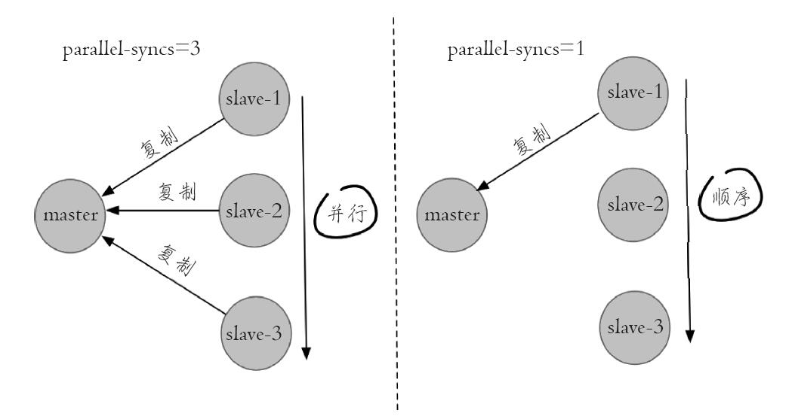

### redis哨兵集群规划
|容器名称 | 容器IP地址 |映射端口号|宿服务运行模式|
|--- | --- | -- | --- | --|
|redis-sentinel1|172.10.0.9|22530->26379|sentinel|
redis-sentinel2|172.10.0.10|22531->26379|sentinel|
redis-sentinel3|172.10.0.11|22532->26379|sentinel|
redis-master2|172.10.0.5|6383 -> 6379|Master|
redis-slave2|172.10.0.6|6384  -> 6379|Slave|
redis-slave3|172.10.0.7|6385 -> 6379|Slave|

#### 生成对应的节点
先生成对应的节点，使用我们之前的redis镜像
```
docker run -itd --name redis-sentinel1 --net mynetwork  -p 22530:26379 --ip 172.10.0.9 redis
docker run -itd --name redis-sentinel2 --net mynetwork  -p 22531:26379 --ip 172.10.0.10 redis
docker run -itd --name redis-sentinel3 --net mynetwork  -p 22532:26379 --ip 172.10.0.11 redis

docker run -itd --name redis-master2 --net mynetwork  -p 6383:6379 --ip 172.10.0.5 redis
docker run -itd --name redis-slave2 --net mynetwork  -p 6384:6379 --ip 172.10.0.6 redis
docker run -itd --name redis-slave3 --net mynetwork  -p 6385:6379 --ip 172.10.0.7 redis
```
#### 配置redis 主从
进入redis 节点 ，修改配置文件
```
vi /etc/redis.conf

bind 0.0.0.0 
protected-mode no #关闭保护模式
daemonize yes #后台运行

redis-server /etc/redis.conf #启动redis
```
注意：这里我并没有设置密码，设密码还要修改 masterauth，requirepass <br/>
3个redis节点都启动，然后在从节点(redis-slave2,redis-slave3)上指定主节点
```
slaveof 172.10.0.5 6379
#172.10.0.5 主节点ip
```
查看主节点 
```
127.0.0.1:6379> info replication
# Replication
role:master
connected_slaves:2
slave0:ip=172.10.0.7,port=6379,state=online,offset=31067,lag=0
slave1:ip=172.10.0.6,port=6379,state=online,offset=31067,lag=0
```
#### 配置哨兵
```
docker exec -it redis-sentinel1 bash #进入哨兵节点
```
修改配置 vi /etc/redis-sentinel.conf
```
bind 0.0.0.0 #绑定端口
protected-mode no #关闭保护模式
sentinel monitor mymaster 172.10.0.5 6379 2 #设置监听ip+port
#sentinel auth-pass mymaster 123456 #设置监听节点的密码
redis-sentinel /etc/redis-sentinel.conf & #启动哨兵
```
重复操作，将剩余2个哨兵节点启动，查看情况
```
127.0.0.1:26379> info sentinel
# Sentinel
sentinel_masters:1
sentinel_tilt:0
sentinel_running_scripts:0
sentinel_scripts_queue_length:0
sentinel_simulate_failure_flags:0
master0:name=mymaster,status=ok,address=172.10.0.5:6379,slaves=2,sentinels=3
# SENTINEL sentinels mymaster #显示监听mymaster节点的哨兵详细情况
```
address=172.10.0.5:6379,slaves=2,sentinels=3 ，有3个哨兵在监视mymaster
#### 测试

```
docker exec -it redis-master2 bash #进入redis主节点
kill -9 redisPid #停止redis
```
查看哨兵日志(/var/log/redis/sentinel.log)
```
slave-reconf-sent slave 172.10.0.7:6379 172.10.0.7 6379 @ mymaster 172.10.0.5 6379
29:X 08 Sep 23:37:25.404 # -odown master mymaster 172.10.0.5 6379
29:X 08 Sep 23:37:25.874 * +slave-reconf-inprog slave 172.10.0.7:6379 172.10.0.7 6379 @ mymaster 172.10.0.5 6379
29:X 08 Sep 23:37:26.936 * +slave-reconf-done slave 172.10.0.7:6379 172.10.0.7 6379 @ mymaster 172.10.0.5 6379
29:X 08 Sep 23:37:27.037 # +failover-end master mymaster 172.10.0.5 6379
29:X 08 Sep 23:37:27.037 # +switch-master mymaster 172.10.0.5 6379 172.10.0.6 6379
29:X 08 Sep 23:37:27.037 * +slave slave 172.10.0.7:6379 172.10.0.7 6379 @ mymaster 172.10.0.6 6379
```
查看主节点
```
[root@38a46ca04893 /]# redis-cli -p 26379
127.0.0.1:26379> SENTINEL get-master-addr-by-name mymaster
1) "172.10.0.6"
2) "6379"
```
看到主节点，已经由原来的172.10.0.5，自动切换为172.10.0.6，然后从新启动172.10.0.5
```
[root@7b272df873aa /]# redis-server /etc/redis.conf &
[1] 66
[root@7b272df873aa /]# redis-cli
127.0.0.1:6379> info replication
# Replication
role:slave
master_host:172.10.0.6
master_port:6379
master_link_status:up
```
后面又尝试了用外网ip,不过没有配合成功。。。。。
### Sentinel 的核心配置：
```
sentinel monitor mymaster 127.0.0.1 7000 2 
#监控的主节点的名字、IP 和端口，最后一个2的意思是有几台 Sentinel 发现有问题，就会发生故障转移，例如 配置为2，代表至少有2个 Sentinel 节点认为主节点不可达，那么这个不可达的判定才是客观的。对于设置的越小，那么达到下线的条件越宽松，反之越严格。一般建议将其设置为 Sentinel 节点的一半加1
```
```
sentinel down-after-millseconds mymaster 30000
#这个是超时的时间（单位为毫秒）。打个比方，当你去 ping 一个机器的时候，多长时间后仍 ping 不通，那么就认为它是有问题
```
```
sentinel parallel-syncs mymaster 1 
#当 Sentinel 节点集合对主节点故障判定达成一致时，Sentinel 领导者节点会做故障转移操作，选出新的主节点，原来的从节点会向新的主节点发起复制操作，parallel-syncs 就是用来限制在一次故障转移之后，每次向新的主节点发起复制操作的从节点个数，指出 Sentinel 属于并发还是串行。1代表每次只能复制一个，可以减轻 Master 的压力；
```


```
sentinel auth-pass <master-name> <password>
#如果 Sentinel 监控的主节点配置了密码，sentinel auth-pass 配置通过添加主节点的密码，防止 Sentinel 节点对主节点无法监控。
```
```
sentinel failover-timeout mymaster 180000
表示故障转移的时间。
```
### Sentinel命令
sentinel支持的合法命令如下：
- SENTINEL masters 显示被监控的所有master以及它们的状态.
- SENTINEL master \<master name> 显示指定master的信息和状态；
- SENTINEL slaves \<master name> 显示指定master的所有slave以及它们的状态；
- SENTINEL get-master-addr-by-name \<master name> 返回指定master的ip和端口，如果正在进行failover或者failover已经完成，将会显示被提升为master的slave的ip和端口。
- SENTINEL sentinels \<master name> 查看哨兵的状态
- info sentinel 查看哨兵信息 
- SENTINEL failover \<master name> 强制sentinel执行failover，并且不需要得到其他sentinel的同意。但是failover后会将最新的配置发送给其他sentinel。

### 生产环境中部署技巧
1. Sentinel 节点不应该部署在一台物理“机器”上。<br/>
这里特意强调物理机是因为一台物理机做成了若干虚拟机或者现今比较流行的容器，它们虽然有不同的 IP 地址，但实际上它们都是同一台物理机，同一台物理机意味着如果这台机器有什么硬件故障，所有的虚拟机都会受到影响，为了实现 Sentinel 节点集合真正的高可用，请勿将 Sentinel 节点部署在同一台物理机器上。

2. 部署至少三个且奇数个的 Sentinel 节点。<br/>
3个以上是通过增加 Sentinel 节点的个数提高对于故障判定的准确性，因为领导者选举需要至少一半加1个节点，奇数个节点可以在满足该条件的基础上节省一个节点

