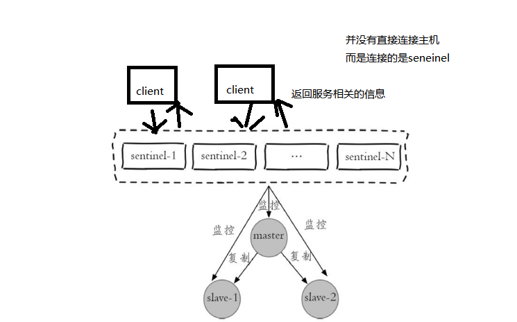
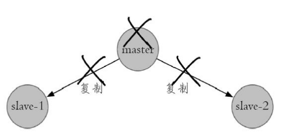
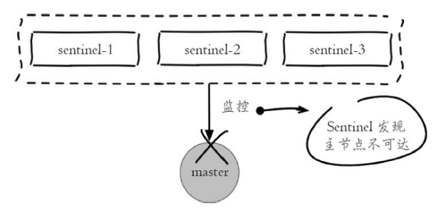
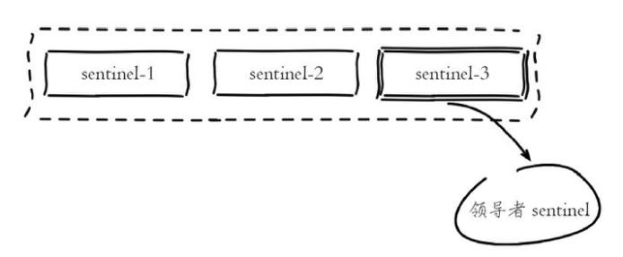
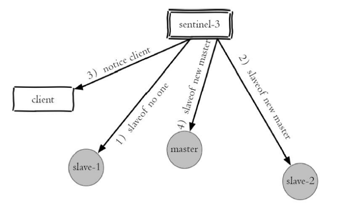
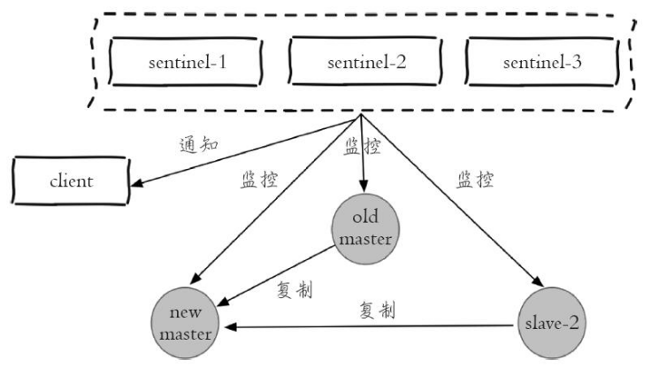

### 一、主从复制的问题
Redis 复制有一个缺点，当主机 Master 宕机以后，我们需要人工解决切换，比如使用slaveof no one 。实际上主从复制并没有实现，高可用， 高可用侧重备份机器， 利用集群中系统的冗余，当系统中某台机器发生损坏的时候，其他后备的机器可以迅速的接替它来启动服务。
#### 二、哨兵机制的原理及实现
Redis Sentinel 是一个分布式架构，其中包含若干个 Sentinel 节点和 Redis 数据节点，每个 Sentinel 节点会对数据节点和其余 Sentinel 节点进行监控，当它发现节点不可达时，会对节点做下线标识。如果被标识的是主节点，它还会和其他 Sentinel 节点进行“协商”，当大多数 Sentinel 节点都认为主节点不可达时，它们会选举出一个 Sentinel 节点来完成自动故障转移的工作，同时会将这个变化实时通知给 Redis 应用方。整个过程完全是自动的，不需要人工来介入，所以这套方案很有效地解决了 Redis 的高可用问题。

基本的故障转移流程：
- 主节点出现故障，此时两个从节点与主节点失去连接，主从复制失败。 

- 每个 Sentinel 节点通过定期监控发现主节点出现了故障 

- 多个 Sentinel 节点对主节点的故障达成一致会选举出其中一个节点作为领导者负责故障转移。 

- Sentinel 领导者节点执行了故障转移，整个过程基本是跟我们手动调整一致的，只不过是自动化完成的。 

- 故障转移后整个 Redis Sentinel 的结构,重新选举了新的主节点 

并且Redis Sentinel 具有以下几个功能:
    - 监控：Sentinel 节点会定期检测 Redis 数据节点、其余 Sentinel 节点是否可达。
    - 通知：Sentinel 节点会将故障转移的结果通知给应用方。
    - 主节点故障转移：实现从节点晋升为主节点并维护后续正确的主从关系。
    - 配置提供者：在 Redis Sentinel 结构中，客户端在初始化的时候连接的是 Sentinel 节点集合，从中获取主节点信息。

    - 同时Redis Sentinel 包含了若个 Sentinel 节点，这样做也带来了两个好处：
        - 对于节点的故障判断是由多个 Sentinel 节点共同完成，这样可以有效地防止误判
        - Sentinel 节点集合是由若干个 Sentinel 节点组成的，这样即使个别 Sentinel 节点不可用，整个 Sentinel 节点集合依然是健壮的
        
但是 Sentinel 节点本身就是独立的 Redis 节点，只不过它们有一些特殊，它们不存储数据，只支持部分命令

### 哨兵常见问题
哨兵集群在发现master node挂掉后会进行故障转移，也就是启动其中一个slave node为master node。在这过程中，可能会导致数据丢失的情况。

**1.异步复制导致数据丢失** 
因为master->slave的复制是异步，所以可能有部分还没来得及复制到slave就宕机了，此时这些部分数据就丢失了。

**2.集群脑裂导致数据丢失** 
脑裂，也就是说，某个master所在机器突然脱离了正常的网络，跟其它slave机器不能连接，但是实际上master还运行着。 

**造成的问题** 
- 此时哨兵可能就会认为master宕机了，然后开始选举，讲其它slave切换成master。这时候集群里就会有2个master，也就是所谓的脑裂。
- 此时虽然某个slave被切换成了master，但是可能client还没来得及切换成新的master，还继续写向旧的master的数据可能就丢失了。
- 旧master再次恢复的时候，会被作为一个slave挂到新的master上去，自己的数据会被清空，重新从新的master复制数据。

**怎么解决？** 

min-slaves-to-write 1
min-slaves-max-lag  10
 
要求至少有1个slave，数据复制和同步的延迟不能超过10秒
如果说一旦所有的slave，数据复制和同步的延迟都超过了10秒钟，那么这个时候，master就不会再接收任何请求了

上面两个配置可以减少异步复制和脑裂导致的数据丢失

1、异步复制导致的数据丢失
    
在异步复制的过程当中，通过min-slaves-max-lag这个配置，就可以确保的说，一旦slave复制数据和ack延迟时间太长，就认为可能master宕机后损失的数据太多了，那么就拒绝写请求，这样就可以把master宕机时由于部分数据未同步到slave导致的数据丢失降低到可控范围内

2、集群脑裂导致的数据丢失

 集群脑裂因为client还没来得及切换成新的master，还继续写向旧的master的数据可能就丢失了通过min-slaves-to-write 确保必须是有多少个从节点连接，并且延迟时间小于min-slaves-max-lag多少秒