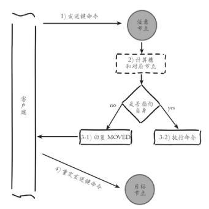

### redis哨兵+主从的问题
主从结构+哨兵可以实现高可用故障切换+冗余备份，但是并不能解决数据容量的问题，用哨兵，redis每个实例也是全量存储，每个redis存储的内容都是完整的数据，浪费内存且有木桶效应。
### Redis Cluster
#### 简介
Redis Cluster 是 Redis 的分布式解决方案，在3.0版本正式推出，有效地解决了 Redis 分布式方面的需求。当遇到单机内存、并发、流量等瓶颈时，可以采用 Cluster 架构方案达到负载均衡的目的。

Redis 集群提供了以下两个好处：
1. 将数据自动切分到多个节点的能力。
2. 当集群中的一部分节点失效或者无法进行通讯时， 仍然可以继续处理命令请求的能力，拥有自动故障转移的能力。
#### redis cluster vs. replication + sentinal如何选择
数据量很少，主要是承载高并发高性能的场景，比如你的缓存一般就几个G，单机足够了。
- Replication：一个mater，多个slave，要几个slave跟你的要求的读吞吐量有关系，结合sentinal集群，去保证redis主从架构的高可用性，就可以了。
- redis cluster：主要是针对海量数据+高并发+高可用的场景，海量数据，如果你的数据量很大，那么建议就用redis cluster。
#### 数据分布是如何进行的
数据分布有两种方式，顺序分区和哈希分区。分布式数据库首先要解决把整个数据集按照分区规则映射到多个节点的问题，即把数据集划分到多个节点上，每个节点负责整体数据的一个子集。

**顺序分布**<br/>
就是把一整块数据分散到很多机器中，如下图所示。<br/>
<br/>
顺序分布一般都是平均分配的。
**哈希分区**<br/>
如下图所示，1~100这整块数字，通过 hash 的函数，取余产生的数。这样可以保证这串数字充分的打散，也保证了均匀的分配到各台机器上。
<br/>
哈希分布和顺序分布只是场景上的适用。哈希分布不能顺序访问，比如你想访问1~100，哈希分布只能遍历全部数据，同时哈希分布因为做了 hash 后导致与业务数据无关了。
|分区方式|特点|
|--|--|
|哈希分区|离散度高<br/>数据分布于业务无关<br/>无法顺序访问|
|顺序分区|离散度易倾斜<br/>数据分布业务相关<br/>可顺序访问|
#### 数据倾斜与数据迁移跟节点伸缩
- 顺序分布是会导致数据倾斜的，主要是访问的倾斜。每次点击会重点访问某台机器，这就导致最后数据都到这台机器上了，这就是顺序分布最大的缺点。
- 哈希分布其实是有个问题的，当我们要扩容机器的时候，专业上称之为“节点伸缩”，这个时候，因为是哈希算法，会导致数据迁移
### 哈希分区方式
redis-cluster使用的就是哈希分区规则
#### 节点取余分区
使用特定的数据（包括redis的键或用户ID），再根据节点数量N，使用公式：hash(key)%N计算出一个0~（N-1）值，用来决定数据映射到哪一个节点上。即哈希值对节点总数取余。余数x，表示这条数据存放在第（x+1）个节点上。

**缺点**：当节点数量N变化时（扩容或者收缩），数据和节点之间的映射关系需要重新计算，这样的话，按照新的规则映射，要么之前存储的数据找不到，要么之前数据被重新映射到新的节点（导致以前存储的数据发生数据迁移）

**实践**：常用于数据库的分库分表规则，一般采用预分区的方式，提前根据数据量规划好分区数，比如划分为512或1024张表，保证可支撑未来一段时间的数据量，再根据负载情况将表迁移到其他数据库中。
#### 一致性哈希
一致性哈希分区（Distributed Hash Table）实现思路是为系统中每个节点分配一个 token，范围一般在0~232，这些 token 构成一个哈希环。数据读写执行节点查找操作时，先根据 key 计算 hash 值，然后顺时针找到第一个大于等于该哈希值的 token 节点<br/>
<br/>
假设我们有 n1~n4 这四台机器，我们对每一台机器分配一个唯一 token，每次有数据（图中黄色代表数据），一致性哈希算法规定每次都顺时针漂移数据，也就是图中黄色的数 据都指向 n3。

这个时候我们需要增加一个节点 n5，在 n2 和 n3 之间，数据还是会发生漂移（会偏移到大于等于的节点），但是这个时候你是否注意到，其实只有 n2~n3 这部分的数据被漂移，其他的数据都是不会变的，这种方式相比节点取余最大的好处在于加入和删除节点只影响哈希环中相邻的节点，对其他节点无影响

**缺点**：每个节点的负载不相同，因为每个节点的hash是根据key计算出来的,换句话说就是假设key足够多，被hash算法打散得非常均匀，但是节点过少，导致每个节点处理的key个数不太一样，甚至相差很大，这就会导致某些节点压力很大

**实践**：加减节点会造成哈希环中部分数据无法命中，需要手动处理或者忽略这部分数据，因此一致性哈希常用于缓存场景
#### 虚拟槽分区
虚拟槽分区巧妙地使用了哈希空间，使用分散度良好的哈希函数把所有数据映射到
一个固定范围的整数集合中，整数定义为槽（slot）。这个范围一般远远大于节点数，比如 Redis Cluster 槽范围是0~16383。槽是集群内数据管理和迁移的基本单位。采用大范围槽的主要目的是为了方便数据拆分和集群扩展。每个节点会负责一定数量的槽，下图所示

当前集群有5个节点，每个节点平均大约负责3276个槽。由于采用高质量的哈希算法，每个槽所映射的数据通常比较均匀，将数据平均划分到5个节点进行数据分区。Redis Cluster 就是采用虚拟槽分区，下面就介绍 Redis 数据分区方法。<br/>
<br/>

每当 key 访问过来，Redis Cluster 会计算哈希值是否在这个区间里。它们彼此都知道对应的槽在哪台机器上，这样就能做到平均分配了。

### 安装docker-compose
curl方式下载版本https://github.com/docker/compose/releases/
```
curl -L https://github.com/docker/compose/releases/download/1.25.0-rc2/docker-compose-`uname -s`-`uname -m` -o /usr/local/bin/docker-compose

chmod +x /usr/local/bin/docker-compose
```
安装完成后可以查看版本：
```
docker-compose --version
```
#### 一般步骤
1. 定义Dockerfile，方便迁移到任何地方；
2. 编写docker-compose.yml文件；
3. 运行docker-compose up启动服务

```
docker-compose up #启动应用
docker-compose up –d #服务后台后启动
docker-compose ps #查看状态
docker-compose stop #停止服务
docker-compose restart # 重新启动服务
```
### 搭建集群
搭建集群工作需要以下三个步骤：
1. 准备节点
2. 节点握手
3. 分配槽

#### 准备节点
**性能**：这是Redis赖以生存的看家本领，增加集群功能后当然不能对性能产生太大影响，所以Redis采取了P2P而非Proxy方式、异步复制、客户端重定向等设计，而牺牲了部分的一致性、使用性。

**水平扩展**：集群的最重要能力当然是扩展，文档中称可以线性扩展到1000结点。
可用性：在Cluster推出之前，可用性要靠Sentinel保证。有了集群之后也自动具有了Sentinel的监控和自动Failover能力。

Redis 集群一般由多个节点组成，节点数量至少为6个才能保证组成完整高可用的集群，前面的主从复制跟哨兵共同构成了高可用。

每个节点需要开启配置 cluster-enabled yes，让 Redis 运行在集群模式下。集群相关配置如下：
```
port 6379  #节点端口 
cluster-enabled yes #开启集群模式
cluster-node-timeout 15000 #节点超时时间，单位毫秒
cluster-config-file "nodes-6379.conf" #集群内部配置文件
```
<br/>
#### 节点规划
|容器名称|容器IP地址|映射端口号|服务运行模式|
|--|--|--|--|
|redis-master1|172.50.0.2|6391-> 6391|master|
|redis-master2|172.50.0.3|6392-> 6392|master|
|redis-master3|172.50.0.4|6393 -> 6393|master|
|redis-slave1|172.30.0.2|6394 -> 6394|Slave|
|redis-slave2|172.30.0.3|6395 -> 6395|Slave|
|redis-slave3|172.30.0.4|6396 -> 6396|Slave|

Redis 集群一般由多个节点组成，节点数量至少为6个才能保证组成完整高可用的集群。每个节点需要开启配置 cluster-enabled yes，让 Redis 运行在集群模式下,上面的配置都相应的给到redis的配置文件当中并启动。

其他配置和单机模式一致即可，配置文件命名规则 redis-{port}.conf，准备好配置后启动所有节点，第一次启动时如果没有集群配置文件，它会自动创建一份，文件名称采用 cluster-config-file 参数项控制，建议采用 node-{port}.conf 格式定义，也就是说会有两份配置文件

当集群内节点信息发生变化，如添加节点、节点下线、故障转移等。节点会自动保存集群状态到配置文件中。需要注意的是，Redis 自动维护集群配置文件，不要手动修改，防止节点重启时产生集群信息错乱


#### Dockerfile 编写
- 下载redis-trib.rb 
```
https://github.com/beebol/redis-trib.rb
```
- gem安装redis，选版本 ，为下面Dockerfile 编写做准备
```
https://rubygems.org/gems/redis/versions/3.3.1
```
- Dockerfile
```
FROM centos:latest
MAINTAINER panglognxia "1294662090@qq.com"
RUN groupadd -r redis && useradd  -r -g redis redis
RUN  yum -y update &&  yum -y install epel-release \
&&   yum -y install redis  && yum -y install wget \
&&   yum -y install net-tools  \
&&   yum -y install ruby && yum -y install rubygems && yum -y install curl
RUN gem  install redis -v 3.2.1
COPY  ./config/redis-trib.rb  /usr/bin
COPY  ./config/redis.sh       /usr/bin
RUN  mkdir -p /config  \
&& chmod  775  /usr/bin/redis.sh && chmod  775  /usr/bin/redis-trib.sh
```
说明
```
gem  install redis -v 3.2.1  #安装对应redis的版本
COPY  ./config/redis-trib.rb  /usr/bin #将本地config目录中的redis-trib.rb(前面下载的)复制到容器中
COPY  ./config/redis.sh #通样，后面会创建这个shell脚本
mkdir -p /config #容器中创建config文件夹，在docker-compose 编排的时候和宿主机上的config 共享
```
```
https://github.com/panglongxia/docker-redis-cluster/blob/master/Dockerfile
```

#### redis节点配置文件
复制一个redis.conf 配置文件,修改配置项
```
port 6379  #节点端口 
cluster-enabled yes #开启集群模式
cluster-node-timeout 15000 #节点超时时间，单位毫秒
cluster-config-file nodes-6379.conf #集群内部配置文件
```
然后复制6份，nodes-6391.conf、nodes-6392.conf、nodes-6393.conf、nodes-6394.conf、nodes-6395.conf、nodes-6396.conf
上传到宿主机~/config目录，我的是 /wwwdata/software/dockerlearn/redis-cluster-test/config
```
https://github.com/panglongxia/docker-redis-cluster/tree/master/config
```
#### 编写docker-compose 文件
```
https://github.com/panglongxia/docker-redis-cluster/blob/master/docker-compose.yaml
```
#### 建立redis.sh启动脚本
```
#!/bin/bash
redis-server  /config/nodes-${PORT}.conf #PORT在docker-compose 中会指定
```
#### 构造镜像
```
cd 到 Dockerfile 所在目录

docker build -t redis-cluster . 
```
#### docker-compose创建容器
```
docker-compose up -d # -d 后台

docker ps #查看创建的容器
```
依次进入节点，启动redis 节点 
##### 节点握手
节点握手是指一批运行在集群模式下的节点通过 Gossip 协议彼此通信，达到感知对方的过程。节点握手是集群彼此通信的第一步，由客户端发起命令：cluster meet{ip}{port} 
```
docker exec -it redis-master2 bash

cluster meet 172.50.0.2 6391 #redis-master1
cluster meet 172.50.0.4 6393 #redis-master3

#下面的可能是网段原因，172.30.0.2连不上，所以改用了外网地址
cluster meet 49.234.232.49  6394
cluster meet 49.234.232.49  6395
cluster meet 49.234.232.49  6396

#查看节点情况
127.0.0.1:6392> cluster nodes
184b42caa07959ca77a7ff9279704edc1252f9ae 49.234.232.49:6395 master - 0 1568005138674 4 connected
63ed4d71906f1763bb5981f2e799c5a660a6f3ff 172.50.0.2:6391 master - 0 1568005142676 1 connected
85302c818464110eab9c6dfec4f9b70ab4f6b12c 172.50.0.4:6393 master - 0 1568005141674 2 connected
f9dfb081f9ec9640cd6d550c74caf013d5712db4 49.234.232.49:6396 master - 0 1568005140677 0 connected
e80c409384dcdbfe1d8d8adc83bf8d71e2531a95 172.50.0.3:6392 myself,master - 0 0 5 connected
731b0bf8be7cdcc2a48b409cd8143e3beae23d73 49.234.232.49:6394 master - 0 1568005143682 3 connected
```
#### 3.设置从节点
作为一个完整的集群，需要主从节点，保证当它出现故障时可以自动进行故障转移。集群模式下，Reids 节点角色分为主节点和从节点。

首次启动的节点和被分配槽的节点都是主节点，从节点负责复制主节点槽信息和相关的数据。

使用 cluster replicate {nodeId}命令让一个节点成为从节点。其中命令执行必须在对应的从节点上执行，将当前节点设置为 node_id 指定的节点的从节点
```
127.0.0.1:6394> CLUSTER replicate {master1-nodeId} #redis-slave1
127.0.0.1:6395> cluster replicate {master2-nodeId} #redis-slave2
127.0.0.1:6396> cluster replicate {master3-nodeId} #redis-slave3
```
查看

#### 分配槽
```
redis-cli -h 47.98.147.49  -p 6391  cluster addslots {0..5461}
redis-cli -h 47.98.147.49  -p 6392 cluster   addslots {5462..10922}
redis-cli -h 47.98.147.49  -p  6393 cluster addslots {10923..16383}
```
查看


#### 操作集群
```
127.0.0.1:6391> set aa1 123
(error) MOVED 12850 172.50.0.4:6393
#需要指定集群模式 -c
redis-cli -c -p 6391
```
**所有命令**： <br/>
```
CLUSTER info：打印集群的信息。
CLUSTER nodes：列出集群当前已知的所有节点（node）的相关信息。
CLUSTER meet <ip> <port>：将ip和port所指定的节点添加到集群当中。
CLUSTER addslots <slot> [slot ...]：将一个或多个槽（slot）指派（assign）给当前节点。
CLUSTER delslots <slot> [slot ...]：移除一个或多个槽对当前节点的指派。
CLUSTER slots：列出槽位、节点信息。
CLUSTER slaves <node_id>：列出指定节点下面的从节点信息。
CLUSTER replicate <node_id>：将当前节点设置为指定节点的从节点。
CLUSTER saveconfig：手动执行命令保存保存集群的配置文件，集群默认在配置修改的时候会自动保存配置文件。
CLUSTER keyslot <key>：列出key被放置在哪个槽上。
CLUSTER flushslots：移除指派给当前节点的所有槽，让当前节点变成一个没有指派任何槽的节点。
CLUSTER countkeysinslot <slot>：返回槽目前包含的键值对数量。
CLUSTER getkeysinslot <slot> <count>：返回count个槽中的键。
CLUSTER setslot <slot> node <node_id> 将槽指派给指定的节点，如果槽已经指派给另一个节点，那么先让另一个节点删除该槽，然后再进行指派。  
CLUSTER setslot <slot> migrating <node_id> 将本节点的槽迁移到指定的节点中。  
CLUSTER setslot <slot> importing <node_id> 从 node_id 指定的节点中导入槽 slot 到本节点。  
CLUSTER setslot <slot> stable 取消对槽 slot 的导入（import）或者迁移（migrate）。 

CLUSTER failover：手动进行故障转移。
CLUSTER forget <node_id>：从集群中移除指定的节点，这样就无法完成握手，过期时为60s，60s后两节点又会继续完成握手。
CLUSTER reset [HARD|SOFT]：重置集群信息，soft是清空其他节点的信息，但不修改自己的id，hard还会修改自己的id，不传该参数则使用soft方式。

CLUSTER count-failure-reports <node_id>：列出某个节点的故障报告的长度。
CLUSTER SET-CONFIG-EPOCH：设置节点epoch，只有在节点加入集群前才能设置。
```

### redis-trib.rb搭建集群

redis-trib.rb 是采用 Ruby 实现的 Redis 集群管理工具。内部通过 Cluster 相关命令帮我们简化集群创建、检查、槽迁移和均衡等常见运维操作，使用之前需要安装 Ruby 依赖环境。

内部通过 Cluster 相关命令帮我们简化集群创建、检查、槽迁移和均衡等常见运维操作，使用之前需要安装 Ruby 依赖环境，

#### redis-trib.rb握手节点,分配槽，设置主从
清除之前的节点从新生成容器，启动好6个节点之后，使用 redis-trib.rb create 命令完成节点握手和槽分配过程
```
redis-trib.rb create --replicas 1 49.234.232.49:6391  49.234.232.49:6392  49.234.232.49:6393 49.234.232.49:6394 49.234.232.49:6395 49.234.232.49:6396
```
--replicas 参数指定集群中每个主节点配备几个从节点，这里设置为1，redis-trib.rb 会尽可能保证主从节点不分配在同一机器下，因此会重新排序节点列表顺序。节点列表顺序用于确定主从角色，先主节点之后是从节点。创建过程中首先会给出主从节点角色分配的计划，并且会生成报告
### Redis-cluster原理 
#### 节点通信
在分布式存储中需要提供维护节点元数据信息的机制，所谓元数据是指：节点负责哪些数据，是否出现故障等状态信息，Redis 集群采用  Gossip（流言）协议，Gossip 协议工作原理就是节点彼此不断通信交换信息，一段时间后所有的节点都会知道集群完整的信息，这种方式类似流言传播

集群中的每个节点都会单独开辟一个 TCP 通道，用于节点之间彼此通信，通信端口号在基础端口上加10000。
- 每个节点在固定周期内通过特定规则选择几个节点发送 ping 消息。
- 接收到 ping 消息的节点用 pong 消息作为响应。

集群中每个节点通过一定规则挑选要通信的节点，每个节点可能知道全部节点，也可能仅知道部分节点，只要这些节点彼此可以正常通信，最终它们会达到一致的状态。当节点出故障、新节点加入、主从角色变化、槽信息变更等事件发生时，通过不断的 ping/pong 消息通信，经过一段时间后所有的节点都会知道整个集群全部节点的最新状态，从而达到集群状态同步的目的。
#### 集群伸缩
**准备新节点**
|容器名称|容器IP地址|映射端口号|服务运行模式|
|--|--|--|--|
|redis-master4|172.50.0.5|6397->6397|master|
|redis-slave4|172.30.0.5|6398 ->6398|Slave|
**添加新容器**<br/>
```
docker run  -itd  --name redis-master4 -v  /wwwdata/software/dockerlearn/redis-cluster-test/config:/config --net redis-cluster-test_redis-master -e PORT=6397 -p  6397:6397 -p 16397:16397   --ip  172.50.0.5  redis-cluster
docker run  -itd  --name redis-slave4 -v  /wwwdata/software/dockerlearn/redis-cluster/config:/config --net redis-cluster-test_redis-slave -e PORT=6398 -p  6398:6398 -p 16398:16398   --ip  172.30.0.5  redis-cluster
```
启动redis

**加入集群**<br/>
```
redis-trib.rb add-node 49.234.232.49:6397 49.234.232.49:6391
redis-trib.rb add-node 49.234.232.49:6398 49.234.232.49:6391
```
**迁移槽和数据**<br/>
槽是 Redis 集群管理数据的基本单位，首先需要为新节点制定槽的迁移计划，确定原有节点的哪些槽需要迁移到新节点。迁移计划需要确保每个节点负责相似数量的槽，从而保证各节点的数据均匀，比如之前是三个节点，现在是四个节点，把节点槽分布在四个节点上。<br/>
<br/>
槽迁移计划确定后开始逐个把槽内数据从源节点迁移到目标节点<br/>
<br/>

数据迁移过程是逐个槽进行的 流程说明：
- 对目标节点发送导入命令，让目标节点准备导入槽的数据。
- 对源节点发送导出命令，让源节点准备迁出槽的数据。
- 源节点循环执行迁移命令，将槽跟数据迁移到目标节点。

redis-trib 提供了槽重分片功能，命令如下：<br/>
redis-trib.rb reshard host:port --from <arg> --to <arg> --slots <arg> --yes --timeout <arg> --pipeline <arg>
参数说明：
- host：port：必传参数，集群内任意节点地址，用来获取整个集群信息。
- --from：制定源节点的 id，如果有多个源节点，使用逗号分隔，如果是all源节点变为集群内所有主节点，在迁移过程中提示用户输入。
- --to：需要迁移的目标节点的id，目标节点只能填写一个，在迁移过程中提示用户输入。
- --slots：需要迁移槽的总数量，在迁移过程中提示用户输入。
- --yes：当打印出 reshard 执行计划时，是否需要用户输入yes确认后再执行 reshard。
- --timeout：控制每次 migrate 操作的超时时间，默认为60000毫秒。
- --pipeline：控制每次批量迁移键的数量，默认为10。

```
redis-trib.rb reshard 49.234.232.49:6398
...
How many slots do you want to move (from 1 to 16384)? 4096 #输入要转移的槽
What is the receiving node ID? #输入接受数据的节点
...
Please enter all the source node IDs.
  Type 'all' to use all the nodes as source nodes for the hash slots.
  Type 'done' once you entered all the source nodes IDs.
Source node #1:#输入数据来源节点
...
Source node #4:done 
```
**主节点设置**<br/>
扩容之初我们把6397、6398节点加入到集群，节点6397迁移了部分槽和数据作为主节点，但相比其他主节点目前还没有从节点，因此该节点不具备故障转移的能力。

这时需要把节点6398作为6397的从节点，从而保证整个集群的高可用。使用 cluster replicate{masterNodeId}命令为主节点添加对应从节点
<br/>
#### 收缩集群
收缩集群意味着缩减规模，需要从现有集群中安全下线部分节点<br/>
<br/>
- 首先需要确定下线节点是否有负责的槽，如果是，需要把槽迁移到其他节点，保证节点下线后整个集群槽节点映射的完整性。
- 当下线节点不再负责槽或者本身是从节点时，就可以通知集群内其他节点忘记下线节点，当所有的节点忘记该节点后可以正常关闭。

**下线迁移槽**<br/>
下线节点需要把自己负责的槽迁移到其他节点，原理与之前节点扩容的迁移槽过程一致，但是过程收缩正好和扩容迁移方向相反，下线节点变为源节点，其他主节点变为目标节点，源节点需要把自身负责的4096个槽均匀地迁移到其他主节点上。

使用 redis-trib.rb reshard 命令完成槽迁移。
迁移后6397 ，不放在任何节点。
```
a0bbbb2b527a94797066f9d882a754a6670f5fba 49.234.232.49:6397 master - 0 1568012840367 8 connected
```
**忘记节点**<br/>
Redis 提供了 cluster forget{downNodeId}命令实现该功能，会把这个节点信息放入黑名单，但是60s之后会恢复。

生产环境当中使用redis-trib.rb del-node {host：port}{downNodeId}命令进行相关操作
```
redis-trib.rb del-node 49.234.232.49:6391 {6397nodeID}
```
原本6397的从节点，更换了主节点<br/>
<br/>
**平衡槽**<br/>
redis-trib.rb  rebalance
适用于节点的槽不平衡的状态，有槽的节点
- 默认节点加入，要先做节点槽的迁移
- 节点已经迁移了所有的槽信息，并且已经从集群删除后，才可以使用平衡
### 集群常见问题
#### 集群功能限制
Redis 集群相对单机在功能上存在一些限制，需要开发人员提前了解，在使用时做好规避。限制如下：
- key 批量操作支持有限。如 mset、mget，目前只支持具有相同 slot 值的 key 执行批量操作。对于映射为不同 slot 值的 key 由于执行 mget、mset、delete 等操作可能存在于多个节点上因此不被支持。
- key 事务操作支持有限。同理只支持多 key 在同一节点上的事务操作，当多个 key 分布在不同的节点上时无法使用事务功能。
- 不支持多数据库空间。单机下的 Redis 可以支持16个数据库，集群模式下只能使用一个数据库空间，即 db0。
- 复制结构只支持一层，从节点只能复制主节点，不支持嵌套树状复制结构

**解决**：利用redisC扩展解决

#### 重定向问题
在集群模式下，Redis 接收任何键相关命令时首先计算键对应的槽，再根据槽找出所对应的节点，如果节点是自身，则处理键命令；否则回复 MOVED 重定向错误，通知客户端请求正确的节点。
<br/>
#### ASK 重定向问题


Redis 集群支持在线迁移槽（slot）和数据来完成水平伸缩，当 slot 对应的数据从源节点到目标节点迁移过程中，客户端需要做到智能识别，保证键命令可正常执行。例如当一个 slot 数据从源节点迁移到目标节点时，期间可能出现一部分数据在源节点，而另一部分在目标节点

如果键对象不存在，则可能存在于目标节点，这时源节点会回复 ASK 重定向异常。格式如下：（error）ASK{slot}{targetIP}：{targetPort}。

客户端从 ASK 重定向异常提取出目标节点信息，发送 asking 命令到目标节点打开客户端连接标识，再执行键命令。如果存在则执行，不存在则返回不存在信息
<br/>
ASK 与 MOVED 虽然都是对客户端的重定向控制，但是有着本质区别。ASK 重定向说明集群正在进行 slot 数据迁移，客户端无法知道什么时候迁移完成，因此只能是临时性的重定向，客户端不会更新本地的slots 缓存。但是 MOVED 重定向说明键对应的槽已经明确指定到新的节点，因此需要更新 slots 缓存。