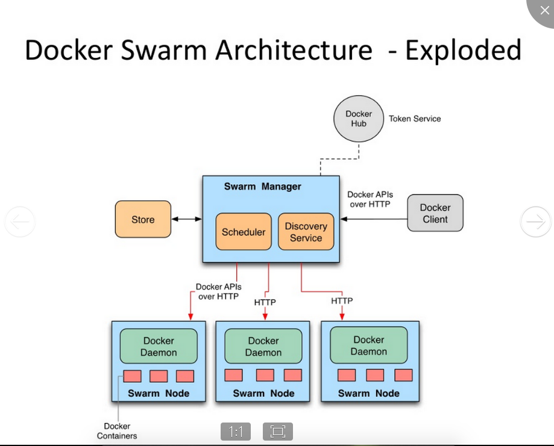
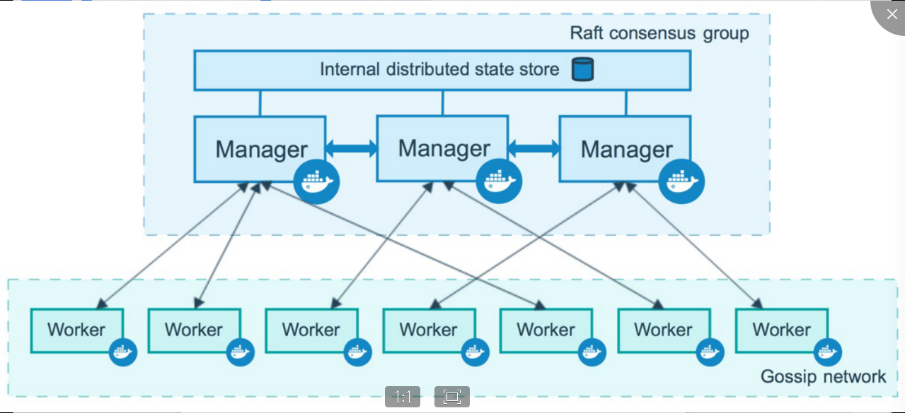
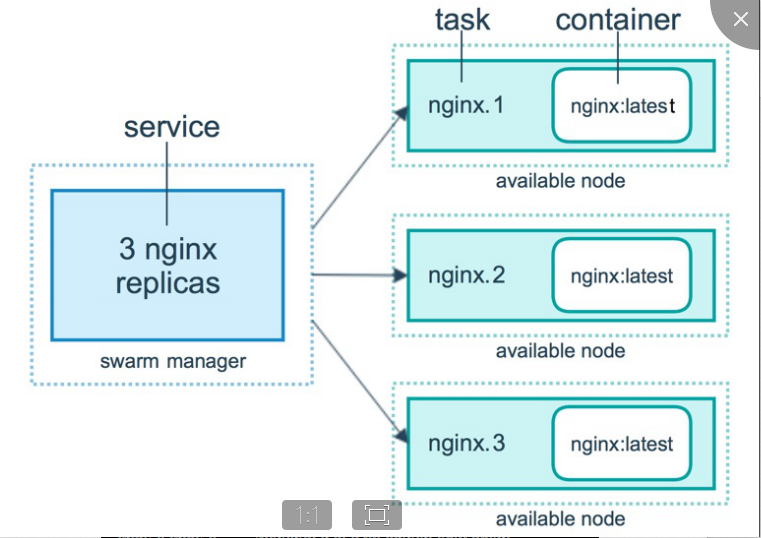
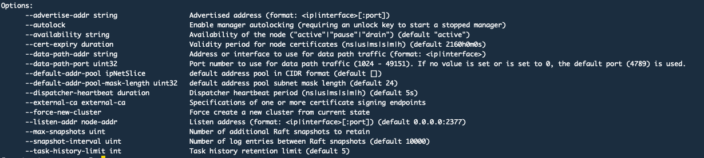
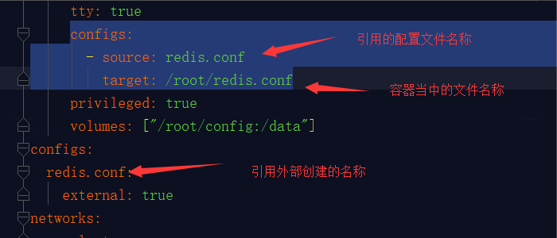
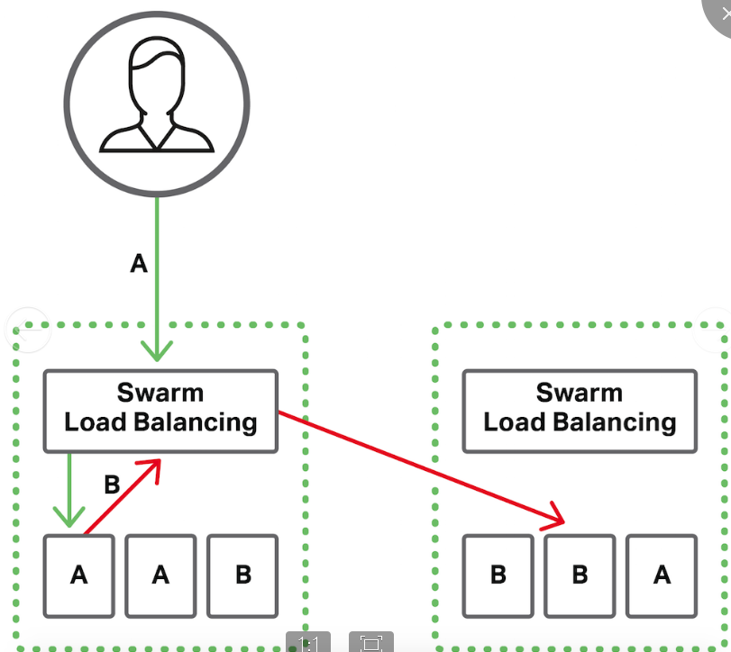

### Docker swarm 介绍
Swarm是Docker公司推出的用来管理docker集群，它将一群Docker宿主机变成一个单一的，虚拟的主机。Swarm使用标准的Docker API接口作为其前端访问入口，换言之，各种形式的Docker Client(docker client in Go, docker_py, docker等)均可以直接与Swarm通信。Swarm几乎全部用go语言来完成开发，Swarm0.2发布，相比0.1版本，0.2版本增加了一个新的策略来调度集群中的容器，使得在可用的节点上传播它们，以及支持更多的Docker命令以及集群驱动.

Swarm deamon只是一个调度器（Scheduler）加路由器(router)，Swarm自己不运行容器，它只是接受docker客户端发送过来的请求，调度适合的节点来运行容器，这意味着，即使Swarm由于某些原因挂掉了，集群中的节点也会照常运行，当Swarm重新恢复运行之后，它会收集重建集群信息．

结构图：


#### 为什么要使用它？
1、应用想要扩容到两台以上的服务器上，多台服务器总是比单台服务器复杂，可以使用docker-swarm进行集群化的管理跟伸缩

2、应用是否有高可用的要求，在docker swarm集群中有两种不同类型的节点，Master节点和Worker节点,其中的一个Master节点是Leader,如果当前Leader宕机不可用，其他健康的Master中的一台会自动成为Leader 。如果Worker节点宕机不可用，宕机节点上的容器实例会被重新调度到其他健康的Worker节点上。
#### 关键概念
<b>Swarm</b><br/>
集群的管理和编排是使用嵌入到docker引擎的SwarmKit，可以在docker初始化时启动swarm模式或者加入已存在的swarm

<b>Node</b><br/>
运行 Docker 的主机可以主动初始化一个 Swarm 集群或者加入一个已存在的 Swarm 集群，这样这个运行 Docker 的主机就成为一个 Swarm 集群的节点 ( node )

节点分为管理 ( manager ) 节点和工作 ( worker ) 节点。

管理节点用于 Swarm 集群的管理， docker swarm 命令基本只能在管理节点执行（节点退出集群命令 docker swarm leave 可以在工作节点执行）。

一个 Swarm 集群可以有多个管理节点，但只有一个管理节点可以成为 leader ， leader 通过 raft 协议实现

工作节点是任务执行节点，管理节点将服务 ( service ) 下发至工作节点执行。管理节点默认也作为工作节点。你也可以通过配置让服务只运行在管理节点。



#### 服务和任务
任务 （ Task ）是 Swarm 中的最小的调度单位，目前来说就是一个单一的容器。

服务 （ Services ） 是指一组任务的集合，服务定义了任务的属性。



<b>docker swarm init 命令参考</b><br/>

```
–cert-expiry
设置节点证书有效期

–dispatcher-heartbeat
设置节点报告它们的健康状态间隔的时间。

–external-ca value
设置集群使用一个外部CA来签发节点证书。value的格式为protocol=X,url=Y。protocol指定的是发送签名请求到外部CA所使用的协议。目前只支持cfssl。URL指定的是签名请求应该提交到哪个endpoint。

–force-new-cluster
强制一个失去仲裁能力的集群的其中一个节点重启成为一单节点集群，而不丢失数据。

–listen-addr value
在这个地址监听集群管理相关流量。默认是监听0.0.0.0:2377。也可以指定一个网络接口来监听这个接口的地址。例如–listen-addr eth0:2377。
端口是可选的。如果仅指定IP地址或接口名称，端口就使用默认的2377。

–advertise-addr value
指定通告给集群的节点的地址，这个地址用来给其它节点访问API和overlay网络通信。如果没有指定地址，docker将检查系统是否只有一个IP地址，如果是将使用这个地址并使用监听的端口(查看–listen-addr)。如果系统有多个IP地址，–advertise-addr就必须指定一个以便内部管理节点能够正常通信和overlay网络通信。
也可以指定一个网络接口来通告接口的地址，例如–advertise-addr eth0:2377。
端口是可选的。如果仅指定一个IP地址或接口名称，就使用端口2377。

–task-history-limit
设置任务历史记录保留限制。
```
<b>初始化</b><br/>
```
$ docker-machine ssh manager
$ docker swarm init --advertise-addr 60.205.182.131
```

<b>加入集群</b><br/>
```
docker加入成为工作节点
$ docker swarm join-token manager #可以查看加入节点的token成为manager
$ docker swarm join-token worker #可以查看加入节点的token成为worker
To add a worker to this swarm, run the following command:
docker swarm join --token SWMTKN-1-10sb8yqvv74e48q84gx06vj755r8nlfdisdixrlvhbd7lx3rrz-dg0jfbnq2i1r24dq8j6042pdr 47.95.222.6:2377

#使旧令牌无效并生成新令牌
docker swarm join-token --rotate
```
<b>查看节点</b><br/>
```
$ docker node ls
$ docker node rm -f {nodeId} #删除节点
```
<b>节点升降级</b><br/>
```
将节点升级为manager:  docker node  promote 结点名 
将节点降级为worker：  docker node  demote 结点名
```
端口开放
``` 
进出（TCP/UDP）端口都开放
2377 集群管理端口
7946 tcp/udp端口 节点间通讯 
4789
```
<b>部署服务</b><br/>
在manager节点部署nginx服务，服务数量为10个，公开指定端口是8080映射容器80,使用nginx镜像
```
$ docker ssh manager
$ docker service create --replicas 10  -p 8080:80 --name nginx  nginx
```
容器当中的软件安装:
```
apt-get update（更新源信息）
apt-get install vim
apt-get install net-tools 
apt-get install iputils-ping
apt-get install psmisc
```

### 服务管理
```
#创建服务
docker service create --name redis --replicas 1  redis:3.0.6
--replicas 服务数量

#更新服务
docker service update  --image  nginx:alpine  nginx

#减少服务实例
docker service scale nginx=0

#增加服务实例
我们可以使用 docker service scale 对一个服务运行的容器数量进行伸缩。
当业务处于高峰期时，我们需要扩展服务运行的容器数量，加机器进入到集群当中
docker service scale nginx=5

#查看所有服务
docker service ls

#查看服务的容器状态
docker service ps nginx

#查看服务的详细信息。
docker service inspect nginx
```
### docker-compose方式部署服务
使用 docker service create 一次只能部署一个服务，如果想要部署多个服务，就需要docker Stack结合 docker-compose.yml 我们可以一次启动多个关联的服务,当然swarm会把这些服务分散到各个工作节点

利用docker-compose配置redis集群，实现redis集群部署以及集群伸缩

需要解决的问题：

<b>文件共享的问题</b>

- Machine主机跟docker虚拟主机之间通讯
- 挂载目录，只能被挂载一次，不能两台远程主机共享一个挂载目录

<b>网络共享问题</b>

使用overly网络
该overlay网络驱动程序会创建多个docker进程主机之间的分布式网络。该网络位于（覆盖）特定于主机的网络之上，允许连接到它的容器（包括群集服务容器）安全地进行通信。Docker透明地处理每个数据包与Docker守护程序主机和正确的目标容器之间正确的的路由。

但是想要不同主机的节点通讯就必须要开放端口
- 用于集群管理通信的TCP端口2377
- TCP和UDP端口7946用于节点之间的通信
- UDP端口4789用于覆盖网络流量
- 2376

swarm在设计之初是为了service(一组container)而服务的，因此通过swarm创建的overlay网络在一开始并不支持单独的container加入其中。但是在docker1.13, 我们可以通过“--attach” 参数声明当前创建的overlay网络可以被container直接加入。
```
docker network create  --attachable  --driver=overlay  myOverly
--attachable   它表明这个网络是可以被不同主机的container所加入
```

<b>配置文件问题</b><br/>
需要一个配置文件的模板，不同的容器当中都能够去拥有这个模板
```
docker config  create  redis.conf  redis.conf
#配置文件名称 文件地址
```


优点：
提供一个所有服务的模板，免去一些公共配置，需要临时修改的时候，修改的复杂度
```
#创建服务
docker stack deploy -c docker-compose.yaml  redis-cluster

创建集群 
redis-trib.rb create --replicas 1  10.0.3.8:6397 10.0.3.9:6397 10.0.3.11:6397 10.0.3.6:6397  10.0.3.8:6397 10.0.3.10:6397
```
相关链接:
```
https://www.cnblogs.com/liuyansheng/p/8178341.html
https://docs-cn.docker.octowhale.com/engine/swarm/networking/
```
### docker swarm重要的特性
#### 集群管理集成进Docker Engine
使用内置的集群管理功能，我们可以直接通过Docker CLI命令来创建Swarm集群，然后去部署应用服务，而不再需要其它外部的软件来创建和管理一个Swarm集群。
#### 去中心化设计
Swarm集群中包含Manager和Worker两类Node，我们可以直接基于Docker Engine来部署任何类型的Node。而且，在Swarm集群运行期间，我们既可以对其作出任何改变，实现对集群的扩容和缩容等，如添加Manager Node，如删除Worker Node，而做这些操作不需要暂停或重启当前的Swarm集群服务。
#### 节点角色切换
管理节点必须是奇数 最少3个节点，否则主节点宕机不能完成切换
#### 声明式服务模型
在我们实现的应用栈中，Docker Engine使用了一种声明的方式，让我们可以定义我们所期望的各种服务的状态，例如，我们创建了一个应用服务栈：一个Web前端服务、一个后端数据库服务、Web前端服务又依赖于一个消息队列服务。
#### 服务扩容缩容
对于我们部署的每一个应用服务，我们可以通过命令行的方式，设置启动多少个Docker容器去运行它。已经部署完成的应用，如果有扩容或缩容的需求，只需要通过命令行指定需要几个Docker容器即可，Swarm集群运行时便能自动地、灵活地进行调整。
#### 协调预期状态与实际状态的一致性
Swarm集群Manager Node会不断地监控集群的状态，协调集群状态使得我们预期状态和实际状态保持一致。例如我们启动了一个应用服务，指定服务副本为10，则会启动10个Docker容器去运行，如果某个Worker Node上面运行的2个Docker容器挂掉了，则Swarm Manager会选择集群中其它可用的Worker Node，并创建2个服务副本，使实际运行的Docker容器数仍然保持与预期的10个一致。

#### 多主机网络
我们可以为待部署应用服务指定一个Overlay网络，当应用服务初始化或者进行更新时，Swarm Manager在给定的Overlay网络中为Docker容器自动地分配IP地址，实际是一个虚拟IP地址。

#### 负载均衡
在Swarm内部，可以指定如何在各个Node之间分发服务容器（Service Container），实现负载均衡。如果想要使用Swarm集群外部的负载均衡器，可以将服务容器的端口暴露到外部。

Docker Swarm负载均衡器运行在每个节点上，可以在集群中任何主机上跨容器负载均衡请求，Swarm负载均衡器处理入站客户端请求（由图3中的绿色箭头表示）以及内部服务到服务请求（由红色箭头表示）。



#### 安全策略
在Swarm集群内部的Node，强制使用基于TLS的双向认证，并且在单个Node上以及在集群中的Node之间，都进行安全的加密通信。我们可以选择使用自签名的根证书，或者使用自定义的根CA（Root CA）证书。

#### 滚动更新（Rolling Update）
对于服务需要更新的场景，我们可以在多个Node上进行增量部署更新，Swarm Manager支持通过使用Docker CLI设置一个delay时间间隔，实现多个服务在多个Node上依次进行部署。这样可以非常灵活地控制，如果有一个服务更新失败，则暂停后面的更新操作，重新回滚到更新之前的版本。
```
docker service update --update-parallelism 2  --image demo:2.0 --update-delay 10s test
--update-parallelism  参数用来指定最大同步更新任务数。
--update-delay       两次更新的间隔，单位默认为秒
```
可以测试更新镜像版本的时候客户端并不会断开连接，服务平滑升级，即服务不停机更新，客户端无感知。
